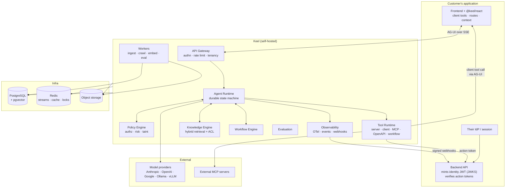
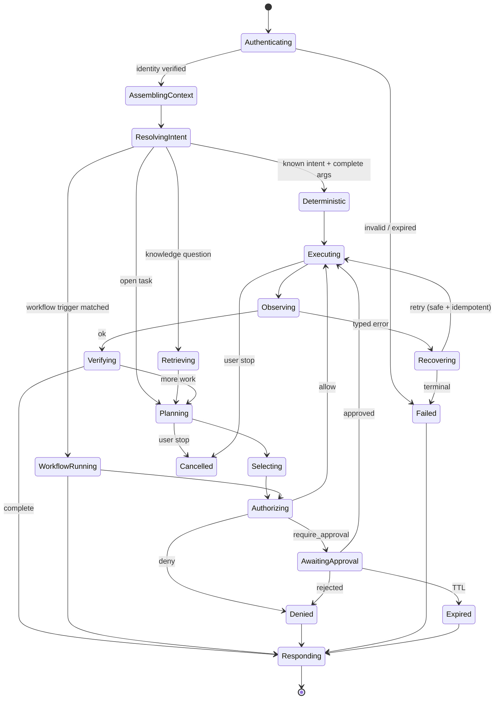

# 01 — Product Thesis, System Architecture, Agent Runtime

## 1. Thesis

> **The open-source control plane that lets an existing application safely delegate work to an AI agent on behalf of an authenticated user.**

Three words carry the weight:

- **Control plane** — not a chat widget, not an orchestration library. The layer that decides *who is asking*, *what they are allowed to do*, *what the agent may see*, *what it actually did*, and *whether that is still true after you change the prompt*.
- **Safely** — authorization, approval, provenance and budgets are runtime primitives, not documentation.
- **On behalf of** — every action is attributable to a real end user with real permissions, and provable as such to the customer's own backend.

### What we are explicitly *not* building

| Not | Because |
|---|---|
| A new frontend↔agent wire protocol | AG-UI exists, is MIT, has ~16 event types including `INTERRUPT` (approval), `ACTIVITY` (frontend-only status), `STATE_DELTA` (JSON Patch), and is implemented by Google, Microsoft, Amazon, Oracle, LangChain, Mastra, PydanticAI. Competing with it is pure loss. |
| A new agent orchestration framework | LangGraph, Mastra and the Agents SDK are good and entrenched. Our runtime exists to *govern* execution, not to win an orchestration API beauty contest. |
| A general LLM app platform | Dify occupies that. Our scope is narrow on purpose: agents embedded in someone else's product, acting for that product's end users. |
| A better model | We claim control and reliability. Not intelligence. |

### Positioning against the two neighbours

```
                 general-purpose  ◄──────────────────────►  in-app, end-user-facing
   library  ▲    LangGraph, Mastra                CopilotKit / AG-UI
            │    (orchestration)                  (frontend + protocol)
            │
            │                                     ┌─────────────────────┐
            │                                     │        US           │
            │                                     │  governed control   │
            │                                     │       plane         │
            │                                     └─────────────────────┘
   product  ▼    Dify                             Crow (hosted, closed)
```

We are the only open-source thing in the bottom-right quadrant. CopilotKit's own ecosystem framing concedes the gap: teams using it "still need model providers, backend tools, permissions, and production safety design."

### Working name

**Keel** — the structural spine a hull is built around. Short, unclaimed-sounding, calm, no bird pun, no "AI" in the name. Package namespace `@keel/*`, CLI binary `keel`, config file `keel.yaml`. **Action required before any public commit: npm org, GitHub org, and trademark search.** Everything below is name-agnostic; a rename is a `sed` and a docs pass if we decide early.

## 2. The core promise

```bash
npm i @keel/react
```

```tsx
import { KeelProvider, Assistant, defineClientTool } from "@keel/react";
import { z } from "zod";

const openCustomer = defineClientTool({
  name: "open_customer",
  description: "Open a customer's profile page.",
  input: z.object({ customerId: z.string() }),
  risk: "read",
  execute: ({ customerId }) => router.push(`/customers/${customerId}`),
});

<KeelProvider
  projectId={process.env.NEXT_PUBLIC_KEEL_PROJECT}
  endpoint="https://keel.internal"
  identity={fetchIdentityToken}          // returns your signed identity JWT
  tools={[openCustomer]}
  context={{ route, orgId, selection }}  // declared, allowlisted, redacted server-side
>
  <Assistant />
</KeelProvider>
```

Properties that matter, and why each is there:

- `identity` is a **function**, not a user object. There is no `userId` prop, anywhere, ever — a client-supplied identifier is not an identity.
- Tools are defined **once, in code**, with a Zod schema. The schema produces the JSON Schema sent to the model, the runtime argument validator, the TypeScript type of `execute`'s parameter, and the props type of any renderer. One definition, four consumers, no dashboard upload step, no drift.
- `context` is an explicit allowlist. Nothing is scraped from the DOM by default.
- `risk` is required on every tool. Making it required is a design decision: it forces the developer to think about blast radius at the moment they expose a capability.

## 3. System architecture



### Module boundaries (modular monolith, one deployable + one worker)

```
services/api            HTTP surface. Zero business logic. Auth, tenancy, validation, mapping.
  ├── modules/identity      identity tokens, action tokens, JWKS, sessions
  ├── modules/projects      org / project / agent / environment / membership
  ├── modules/conversations threads, messages, AG-UI event stream
  ├── modules/runs          run + step records, cancellation, replay
  ├── modules/tools         tool registry, versions, contracts, playground
  ├── modules/knowledge     sources, documents, chunks, retrieval API
  ├── modules/workflows     definitions, versions, runs
  ├── modules/policy        policy documents, evaluation, decision log
  ├── modules/evaluation    datasets, cases, runs, baselines
  └── modules/activity      traces, metrics, webhooks, audit

packages/agent-runtime   pure: state machine, no HTTP, no DB driver (ports only)
packages/policy-engine   pure: decisions from (principal, tool, args, taint, env)
packages/tool-runtime    adapters: server, client, mcp, openapi, workflow, navigation
packages/knowledge-engine ingestion pipeline + retrieval planner
packages/workflow-engine  graph validation + execution semantics
packages/model-providers  provider interface + implementations + router
packages/contracts        JSON Schemas, event types, AG-UI extensions — single source of truth
```

**Rule:** `packages/*` never import `services/*`. Every external dependency (DB, LLM, HTTP, clock, random) enters the runtime through a port interface, so the whole runtime is testable without a network and replayable from a step log. This is what makes deterministic replay and evaluation possible at all; it is not architecture astronomy.

**Only split a service out when there is an operational reason.** The one on the horizon is ingestion (CPU-heavy, bursty, different scaling curve) — hence `worker` is already a separate process from day one, sharing the same codebase.

## 4. Agent runtime

### 4.1 Why a state machine and not a loop

Three requirements make the obvious `while (!done) { llm(); tool(); }` untenable:

1. **Approvals can take hours.** The run must survive process restart and deploy.
2. **Cancellation must reach the worker**, not just close the SSE stream.
3. **Replay must be exact** for evaluation and for "why did it do that?"

So: every transition appends a `run_step` row and advances a persisted `run.state`. The in-memory executor is a cache over that log. Kill the pod mid-run and another picks it up from the last committed step.

### 4.2 Components

| Component | Responsibility | Deliberately *not* |
|---|---|---|
| **Context Manager** | Assemble the model's view: system + developer instructions, allowlisted client context, conversation window, retrieved knowledge, tool catalogue filtered by policy. Attach an integrity label to every block. | Deciding what the user may do. |
| **Intent Resolver** | Cheap classifier: known-deterministic intent, workflow trigger, knowledge question, or open task. Routes ~40% of traffic away from the expensive path. | Answering. |
| **Planner (P-LLM)** | Produce the next action from **trusted inputs and symbolic references only**. Never sees raw untrusted content. | Executing anything. |
| **Extractor (Q-LLM)** | Read untrusted content (retrieved docs, web pages, third-party MCP output) with **no tool access** and return values conforming to a declared schema. Output is labelled `untrusted`. | Deciding actions. |
| **Tool Selector** | Resolve the planner's intent to a concrete tool version + validated arguments. | Inventing tools. |
| **Policy Engine** | `allow / deny / require_approval` from principal, tool, arguments, argument **taint**, resource, risk, environment, budget. Deterministic, no model in the path. | Being advisory. Its decision is final and logged. |
| **Tool Executor** | Dispatch to the right adapter with timeout, retry class, idempotency key, cache policy, cancellation token. | Interpreting results. |
| **Result Evaluator** | Validate the result against the tool's output schema; classify errors into the taxonomy; assign integrity labels. | Retrying. |
| **Verification Engine** | Post-conditions on mutations: after `update_subscription`, read back and confirm. Cheap, deterministic, catches the "the model said it worked" failure mode. | Guessing. |
| **Recovery Manager** | Per-error-class strategy. Retry only what is safe *and* idempotent. | Blind retry. |
| **Approval Manager** | Persist the pause, emit `INTERRUPT`, hold the run, resume on decision, expire on timeout. | Trusting a client-side confirm. |
| **Memory Manager** | Read/write the four memory scopes (below) under explicit configuration. | Storing everything by default. |
| **Response Generator** | Compose the user-facing answer with citations, artifacts and renderer hints. | Fabricating a summary of a failed call. |

### 4.3 Lifecycle



`Denied` and `Failed` route through `Responding`, not to `[*]`: the user always gets an explanation, and it is generated from the *typed decision*, never by asking the model to guess why it failed.

**Budget checks** (tokens, model calls, tool calls, wall clock, cost) are evaluated on entry to `Planning` and `Executing`. Exceeding a limit is a normal transition to `Failed(AgentLimitError)`, not an exception.

### 4.4 Trust boundaries

Five levels, propagated through every value in the run:

```
system      Keel's own instructions.                          immutable
developer   Agent instructions, tool descriptions, policies.  set via config-as-code
user        The end user's message.                           trusted-intent, untrusted-content
tool        Output of first-party tools.                      integrity = tool's declared level
external    Retrieved docs, crawled pages, 3rd-party MCP.     always untrusted
```

Two invariants, enforced in code by the Policy Engine — the CaMeL/FIDES pattern applied to our domain:

- **I1 (control-flow integrity):** arguments to a tool with `side_effect != read` may not derive from `external` data unless the tool is explicitly marked `accepts_untrusted_args` **or** the call is human-approved.
- **I2 (data-flow confinement):** data retrieved under user U's ACL may not be passed to a tool whose egress is not permitted to receive it. Egress destinations are allowlisted per project.

These are architectural guarantees, not model behaviour. They hold when the injection succeeds. Our docs will say so plainly, and will also say that this reduces blast radius rather than eliminating the risk.

### 4.5 Memory — four scopes, all opt-in

| Scope | Store | Default TTL | Notes |
|---|---|---|---|
| Conversation | Postgres, per thread | project retention | The message log. Always on. |
| Task | Run state, per run | run lifetime | Structured slots the planner fills. Not a vector store. |
| Workflow | Run state, typed by node schema | run lifetime | — |
| Long-term | Postgres, keyed by `(project, identity_subject, key)` | **off by default** | Explicit `memory.keys` allowlist in `keel.yaml`. Each key declares TTL, who may read it, and whether it may enter model context. Deleted on identity deletion request. |

No vector memory in the MVP. "Remember everything and embed it" is how you build an unauditable, un-deletable liability under GDPR/DPDP. If a customer needs semantic recall over history, that is a knowledge source they configure, with the same ACLs.

## 5. Model abstraction

```ts
interface ModelProvider {
  readonly id: string;
  readonly capabilities: Set<"tools" | "vision" | "streaming" | "structured" | "embeddings" | "cache">;
  generate(req: GenerateRequest, signal: AbortSignal): AsyncIterable<GenerateEvent>;
  structured<T>(req: StructuredRequest<T>, signal: AbortSignal): Promise<Structured<T>>;
  embed(req: EmbedRequest, signal: AbortSignal): Promise<EmbedResult>;
  countTokens(input: TokenCountInput): Promise<number>;
}
```

Implementations: Anthropic, OpenAI, Google, Azure OpenAI, Bedrock, generic OpenAI-compatible (covers Ollama, vLLM, LiteLLM, OpenRouter, Together). Every response carries normalised `usage`, `latency`, `provider`, `model`, `finish_reason`, `cost_estimate`.

Non-negotiables: `AbortSignal` on every call (cancellation), no provider type leaking above the interface, provider errors mapped into our taxonomy, and **failover off by default** — silently switching models changes behaviour, so it must be opted into and every fallback is recorded on the run.

### 5.1 Routing

Routing is by **task class**, declared by the runtime, not guessed:

| Class | Typical model tier | Why |
|---|---|---|
| `intent.classify` | small/fast | Short, schema-constrained. |
| `tool.select` | fast reasoning | Latency dominates perceived quality here. |
| `plan.complex` | strong reasoning | Multi-step, mutations, branching. |
| `extract.untrusted` | small, **no tools bound** | Q-LLM. Capability restriction is the point. |
| `respond.compose` | mid | — |
| `vision.*`, `embed.*` | capability-matched | — |

Config:

```yaml
models:
  providers:
    anthropic: { api_key: ${ANTHROPIC_API_KEY} }
    local:     { type: openai_compatible, base_url: http://ollama:11434/v1 }
  routes:
    default:            anthropic/claude-sonnet
    intent.classify:    local/qwen3-4b
    extract.untrusted:  local/qwen3-4b
    plan.complex:       anthropic/claude-opus
  budgets:
    per_run:   { max_cost_usd: 0.50, max_model_calls: 12, max_tool_calls: 20, max_seconds: 120 }
    per_project_month: { max_cost_usd: 200 }
```

Every routing decision writes `{task_class, chosen, reason, tokens, latency_ms, cost}` to the run step. That table is what makes routing tunable instead of superstitious — and it feeds the eval report, so a routing change that saves 40% cost but drops tool accuracy 6% is visible before merge.

## 6. Error taxonomy

A closed union, defined once in `packages/contracts`, and the *only* thing the runtime pattern-matches on. `catch (e)` without narrowing is a lint error.

| Error | Retryable | User-visible framing |
|---|---|---|
| `AuthenticationError` | no | Session expired — re-identify. |
| `AuthorizationError` | no | Not permitted. Names the missing permission. |
| `ApprovalRequiredError` | n/a | Pauses the run; not a failure. |
| `ApprovalRejectedError` / `ApprovalExpiredError` | no | Stated plainly. |
| `ToolValidationError` | no (re-plan once) | The model produced bad arguments; one repair attempt with the validation error, then stop. |
| `ToolExecutionError` | if `5xx` **and** idempotent | Backend error surfaced without leaking internals. |
| `ToolTimeoutError` | if idempotent | — |
| `ToolUnavailableError` | fallback chain | Explains what could not be reached. |
| `KnowledgeRetrievalError` | yes | Degrade to no-context answer, flagged. |
| `ModelProviderError` | yes, with backoff | — |
| `RateLimitError` | yes, honours `Retry-After` | — |
| `AgentLimitError` | no | Budget reached; run stopped safely. |
| `PolicyViolationError` | no | Taint invariant tripped. Logged at high severity. |
| `WorkflowError` | depends | — |
| `IntegrationError` | depends | MCP/OpenAPI transport. |

**Retry rule:** `retryable(error) && tool.idempotent && attempt < tool.retry.max`. A destructive tool without an idempotency key is never retried, full stop.
