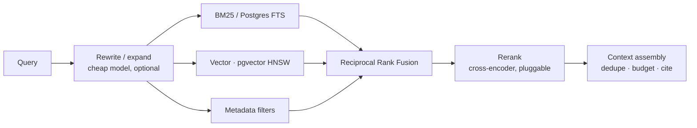

# 03 — Knowledge, Identity, Authorization

## Part A — Knowledge Engine

### A1. Pipeline

```
Source ─► Fetcher ─► Parser ─► Cleaner ─► Chunker ─► Enricher ─► Embedder ─► Index
   │         │          │         │          │           │            │         │
 config   ETag/     format-    boiler-    structure-  title path,   batched,  Postgres
 + ACL    Last-Mod   specific   plate      aware      section,      cached    (FTS + pgvector)
          + hash    extraction  removal    splitting  entities      by hash
```

Every stage is a pure function over the previous stage's output plus config, so any stage can be re-run from stored intermediates. Re-chunking after a parameter change does not re-crawl the internet, and re-embedding after a model change does not re-parse PDFs. This matters more than it sounds: embedding-model migration is otherwise a multi-day outage.

**Sources:** uploaded files (PDF, DOCX, MD, TXT, HTML, CSV, JSON), website crawl (sitemap-first, robots-respecting, depth/domain bounded), Notion, generic HTTP connector, and push-based ingestion via API for customers who want to stream their own docs. All behind one `KnowledgeConnector` interface so a plugin can add Confluence/Drive/Zendesk without touching the engine.

**Change detection:** `content_sha256` per document. Unchanged → no re-parse, no re-embed, `last_seen_at` bumped. Changed → new `document_version`, re-chunk, and **chunks are content-addressed**, so unchanged chunks keep their embeddings. On a typical docs-site re-crawl this is the difference between re-embedding 4,000 chunks and re-embedding 40.

**Chunking** is structure-aware (headings, list boundaries, code fences, table rows kept whole) with token-bounded windows and small overlap. Each chunk stores its heading path, so retrieval can show "Billing → Refunds → Eligibility" rather than an anonymous fragment.

### A2. Retrieval — hybrid, with the ACL inside the query



Keyword retrieval is not optional. Product knowledge is full of identifiers — plan names, SKUs, error codes, endpoint names — that embeddings routinely miss and BM25 nails. RRF fusion avoids score-scale calibration between the two.

Reranking is an interface with three implementations: none, local cross-encoder (ONNX, runs on CPU), hosted reranker. Default in the self-host profile is local, because "requires a paid reranking API" breaks the self-hosting promise.

**The security-critical bit:** the identity's ACL is a **predicate in the SQL**, not a filter applied afterwards.

```sql
SELECT c.id, c.content, c.document_version_id,
       ts_rank_cd(c.tsv, plainto_tsquery($1)) AS kw,
       1 - (c.embedding <=> $2) AS vec
FROM knowledge_chunks c
JOIN knowledge_documents d ON d.id = c.document_id
WHERE d.project_id = $3
  AND d.deleted_at IS NULL
  AND d.version_id = c.document_version_id          -- current version only
  AND (
        d.visibility = 'public'
     OR (d.visibility = 'org'  AND d.org_id = $4)
     OR (d.visibility = 'acl'  AND d.acl_tags && $5::text[])   -- principal's tags
      )
ORDER BY ...
```

Post-filtering leaks. Result counts, score distributions, pagination behaviour and latency all reveal the existence and rough content of documents the user may not see, and a bug in the filter step exposes them outright. Making the ACL part of the index scan means the unauthorized rows are never materialised. This is the single biggest correctness difference between our knowledge base and every competitor in this segment.

`acl_tags` are derived from **verified identity claims only** — group/role claims in the customer's signed token — never from anything the client asserts.

### A3. Versioning and reproducibility

```
knowledge_sources ──1:N──► knowledge_documents ──1:N──► document_versions ──1:N──► chunks
                                                              │
agent_versions ──► knowledge_snapshot_id ──────────────────────┘
```

A `knowledge_snapshot` is an immutable set of `(document_id, version_id)` pairs. Runs record the snapshot they retrieved against. Six weeks later, "why did it say refunds take 14 days?" is answerable: the run points at the snapshot, the snapshot points at the version, the version has the text and its `fetched_at`.

Sync state per source: `pending | crawling | parsing | indexing | ready | partial | failed`, with per-document errors surfaced in the UI (`38 of 412 documents failed: 31 password-protected PDFs, 7 timeouts`) rather than a silent partial index — which is how stale-answer incidents happen.

### A4. Retrieval playground

Developer types a query, optionally impersonates a principal (dev environment only, audited), and sees: rewritten query → candidates from each retriever with raw scores → fused ranking → reranked ranking → what was dropped for budget → the exact context block the model would receive → which ACL predicates excluded what (count only, never content). Debugging RAG without this is guesswork, and it is cheap to build once the pipeline is stage-addressable.

---

## Part B — Identity

### B1. Principle

**A user identifier supplied by a client is not an identity.** The SDK has no `userId` prop. The only accepted proof is a token signed by the customer's own key.

### B2. Token

```jsonc
{
  "iss": "https://app.customer.com",
  "sub": "usr_8812",
  "aud": "keel:proj_9f2",          // audience-bound: not replayable to another project
  "exp": 1754745600,               // ≤ 10 minutes
  "iat": 1754745000,
  "jti": "b0f1…",                  // single-use, replay-cached until exp
  "email": "arun@customer.com",
  "name": "Arun Kumar",
  "org_id": "org_44",
  "roles": ["support_agent"],
  "groups": ["kb:internal", "kb:billing"],   // → knowledge acl_tags
  "permissions": ["customers.read", "subscriptions.write"]
}
```

Signed **EdDSA (Ed25519) or RS256**, verified via the customer's JWKS endpoint with cached keys and rotation support. HS256 is accepted only with an explicit `allow_symmetric: true` and a dashboard warning, because a shared symmetric secret means the verifier can mint tokens — the same weakness as Crow's `CROW_VERIFICATION_SECRET`.

We publish `keel-identity` helpers for Node, Python, Go, Java and Ruby that generate a keypair, expose a JWKS endpoint, and mint tokens correctly. The five-minute integration has to stay five minutes or the security model doesn't get adopted.

Anonymous sessions are supported and clearly second-class: no history, no user-scoped tools, read-only public knowledge, tighter rate limits.

### B3. Session

Identity token → short-lived Keel session bound to `(project, environment, subject, jti)`. Rotation on refresh; revocation on logout (`reset()`); every run records the session and the identity `jti` that authorised it.

---

## Part C — Authorization and the Policy Engine

### C1. Layers

```
1. Platform RBAC     Who may configure Keel.        Owner / Admin / Developer / Viewer (+ custom later)
2. Tenancy           org_id on every row + Postgres RLS.
3. Principal authz   What the END USER may do through the agent.   ← the layer everyone skips
4. Tool policy       Per-tool allow / deny / require_approval.
5. Resource policy   Conditions on arguments and results.
6. Taint policy      Invariants I1 / I2 from the runtime doc.
7. Budget policy     Cost, calls, time.
```

Layer 3 is the one Crow has no answer for, and it is the one that decides whether the platform can be deployed in a bank.

### C2. Policy as data

```yaml
# keel/policy/production.yaml
version: 1
defaults:
  effect: deny                        # default-deny, always

rules:
  - id: reads-for-authenticated
    match: { tool: { risk: read } }
    when:  { principal: { authenticated: true } }
    effect: allow

  - id: subscription-writes
    match: { tool: [update_subscription, cancel_subscription] }
    when:
      principal: { permissions: { contains: subscriptions.write } }
      resource:  { org_id: "${principal.org_id}" }      # no cross-org writes
    effect: allow
    approval: { mode: confirm }

  - id: large-refunds
    match: { tool: refund_payment, args: { amount: { gte: 10000 } } }
    effect: allow
    approval: { mode: approve, by: { role: finance_admin }, expires_in: 30m }

  - id: never-delete-customers
    match: { tool: delete_customer }
    effect: deny
    message: "Customer deletion is not available through the assistant."

  - id: tainted-arguments
    match: { tool: { side_effect: [write, destructive] } }
    when:  { args: { integrity: external } }
    effect: deny
    message: "Refusing to act on instructions found in retrieved content."
```

Properties:

- **Deterministic and total.** No model in the decision path. Same inputs → same decision, always.
- **Default-deny**, with the deny reason surfaced to the user in plain language.
- **Versioned in git**, promoted between environments, diffable in review. Policy change and code change land in the same pull request.
- **Testable.** `keel policy test` runs assertion files; `keel policy explain --tool refund_payment --principal fixtures/support.json` prints the matched rule. Both run in CI.
- **Every evaluation is logged** with the rule id — so "why was this denied?" is a lookup, not an investigation.

### C3. Where enforcement happens

Server-side, in the runtime, **before** the tool adapter is invoked and **before** anything about the tool's existence reaches the model catalogue. Two consequences worth stating: a tool the user may not use is never offered (so the model can't promise it), and the client cannot bypass a decision by crafting its own request, because the client never dispatches tools — it only executes client-side handlers the server authorised.

### C4. Approvals

An approval is a persisted record, not a UI state:

```
{ id, run_id, step_id, tool, tool_version, args, args_sha256, risk,
  requested_by, decide_by_rule, state: pending|approved|rejected|expired,
  decided_by, decided_at, expires_at, reason }
```

- The run **suspends durably**; approvals survive reload, redeploy and hours of delay.
- `args_sha256` is bound into the resulting action token, so an approved call cannot be re-executed with different arguments.
- Approval consumption is single-use and audited.
- The approval card states, in this order: the action, the affected resource, the irreversible consequence, and the cost. Not a conversational sentence with a Yes button — approval fatigue is a real failure mode, and the UI's job is to make the significant ones legible.
