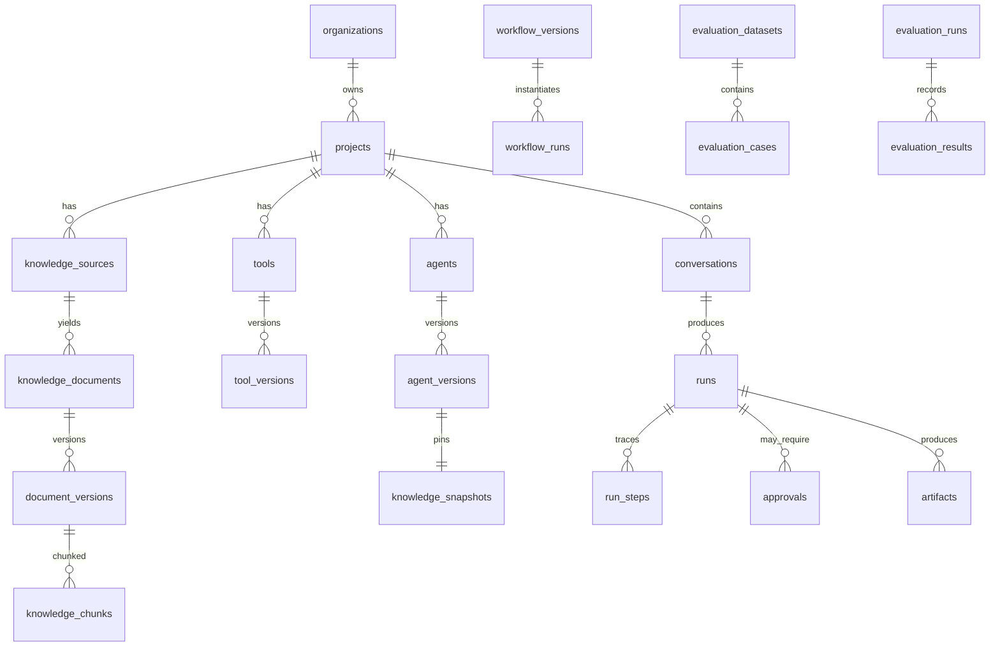

# 04 — Workflow Engine and Data Model

## Part A — Workflow Engine

### A1. What a workflow is here

A **typed, versioned, directed graph** executed by the same durable runtime that runs free-form agent turns. Not a prompt with numbered steps. Crow's linear "Journey" cannot express "unless the plan is annual," which is where every real business process starts.

Design constraints, in priority order:

1. **Deterministic where possible.** Conditions, transforms and routing are code. The model appears only in `agent` and `llm` nodes.
2. **Terminating by construction.** Loops declare bounds in the schema; unbounded iteration is unrepresentable, not merely discouraged.
3. **Versions are immutable.** A run pins `workflow_version_id` at start and never observes a later edit.
4. **Same execution engine as free-form runs.** One state machine, one trace format, one approval mechanism, one cancellation path. Two engines would drift within a quarter.

### A2. Node types

| Node | Purpose | Notes |
|---|---|---|
| `start` / `end` | Entry and terminal | Typed input/output schema on the graph |
| `agent` | Bounded reasoning turn | Restricted tool subset, own budget |
| `llm` | Single structured completion | Output schema required |
| `tool` | Invoke a tool contract | Full policy path applies |
| `condition` | Boolean branch | Deterministic expression over typed state |
| `switch` | N-way branch | Exhaustive or explicit default |
| `loop` | `for_each` / `while` | `max_iterations` **required**; `concurrency` optional |
| `parallel` | Concurrent branches | `max_concurrency`; join policy `all` / `any` / `settled` |
| `approval` | Human decision | Same record type as risk-based approvals |
| `wait` | Until event / timestamp | Durable; survives restart |
| `transform` | Pure data mapping | JSONata or JS in an isolate; no I/O |
| `client_action` | Run something in the browser | Requires a live session; times out otherwise |
| `webhook` / `notification` | Outbound | Signed, retried, idempotent |
| `subworkflow` | Compose | Depth-bounded |

Typed state: the graph declares a state schema; each node declares reads and writes. Validated at save time, so "node 7 reads `customer.plan` which nothing ever wrote" is a save-time error, not a 2am run failure.

### A3. Validation at save time

Reject the graph if: unreachable nodes, missing terminal, unbounded loop, type mismatch across an edge, undeclared state read, a tool reference that doesn't exist at the pinned version, a mutation node downstream of untrusted-integrity state without an approval node, or a `client_action` in a workflow triggered by cron (no browser exists).

### A4. Versioning and promotion

```
draft ──publish──► v3 (immutable) ──promote──► staging ──promote──► production
```

Runs record `workflow_version_id`. Editing production never touches in-flight runs. `keel workflow diff v2 v3` prints a structural diff — this is the export format, so it also diffs cleanly in a normal `git diff`.

### A5. Testing

`keel workflow test refund.yaml --fixtures fixtures/refund/` runs the graph with mocked tool results:

```yaml
mocks:
  get_customer:      { plan: annual, status: active, mrr: 999 }
  check_eligibility: { eligible: false, reason: "annual plan mid-term" }
assert:
  path: [start, get_customer, check_eligibility, offer_alternative, end]
  never_called: [cancel_subscription]
  state: { outcome: retained }
```

Mocked tools are structurally impossible to confuse with real ones: the mock adapter is only registered in the test runtime, and any run started with mocks is flagged `simulated: true` on every record it writes.

### A6. Import/export

The stored representation **is** the file — no lossy round trip through a UI model:

```json
{ "keel": "1", "kind": "workflow", "name": "subscription_cancellation",
  "version": 3, "state_schema": {...}, "nodes": [...], "edges": [...],
  "tools": ["get_customer@2", "cancel_subscription@1"] }
```

### A7. Visual builder (Phase 2, deliberately)

XYFlow (React Flow) — mature, accessible, well-maintained; reinventing node rendering is a month we don't have. The canvas edits the same JSON the CLI reads. Required from day one of Phase 2: undo/redo, keyboard-only node creation and connection, minimap, validation surfaced inline, and a diff view against the published version.

The engine ships first and is usable from YAML alone. A canvas over an engine that can't branch is a demo; an engine without a canvas is a product.

---

## Part B — Data Model

PostgreSQL 16+, `pgvector`. One database, schema-per-concern, `org_id` on every tenant-scoped table with **row-level security enabled** as defence in depth beneath application scoping. All ids are prefixed ULIDs (`run_01J…`) — sortable, and the prefix makes a stray id in a log immediately legible.

### B1. Tables

**Tenancy and identity**
```
organizations        id, name, slug, settings, created_at
users                id, email, name, auth_provider, created_at        -- Keel dashboard users
memberships          org_id, user_id, role(owner|admin|developer|viewer), created_at
projects             id, org_id, name, slug, settings
environments         id, org_id, project_id, name(development|staging|production), config
                     -- org_id is denormalised from projects so the RLS policy has a local
                     -- column to test. A composite FK (project_id, org_id) -> projects
                     -- (id, org_id) is what stops the two from diverging.
api_keys             id, org_id, project_id, name, hash, scopes[], last_used_at, expires_at
                     -- same composite FK, same reason. hash is sha256 hex, CHECK-constrained
                     -- so a plaintext key is a constraint violation rather than a review finding
identity_configs     id, project_id, issuer, jwks_uri, algorithms[], audience, allow_symmetric
end_user_identities  id, project_id, subject, first_seen_at, last_seen_at, claims_digest
                     -- claims are NOT persisted; digest only, for correlation
```

**Agents**
```
agents               id, project_id, name, slug, current_version_id
agent_versions       id, agent_id, version, instructions, model_config, tool_selection[],
                     knowledge_snapshot_id, policy_version_id, workflow_bindings[],
                     published_at, published_by, notes
                     -- immutable once published; runs reference this row
```

**Conversations and runs**
```
conversations        id, project_id, environment_id, identity_id?, agent_version_id,
                     title, status, started_at, last_activity_at, metadata
messages             id, conversation_id, role, content, created_at, run_id?
runs                 id, conversation_id?, project_id, environment_id, agent_version_id,
                     identity_id?, trigger(chat|api|webhook|schedule|eval),
                     state, idempotency_key?, simulated bool,
                     started_at, ended_at, error_class?, cost_usd, tokens_in, tokens_out
run_steps            id, run_id, seq, type(context|retrieval|model|tool|policy|approval|
                                            verify|recover|route|response),
                     started_at, ended_at, status, payload jsonb, integrity, error_class?,
                     tool_version_id?, model, tokens_in, tokens_out, cost_usd, latency_ms
                     -- the trace. append-only. (run_id, seq) unique.
```

`run_steps` is the highest-volume table and the backbone of traces, evaluation, replay and analytics. Partitioned monthly by `started_at`; retention policy prunes partitions rather than deleting rows.

**Tools**
```
tools                id, project_id, name, target, current_version_id, enabled
tool_versions        id, tool_id, version, contract jsonb, source(openapi|mcp|client|native),
                     source_ref, created_at, checksum
tool_bindings        id, tool_version_id, environment_id, auth_binding jsonb, base_url,
                     secret_ref, enabled
```

**Knowledge**
```
knowledge_sources    id, project_id, type, config jsonb, status, last_sync_at, error?
knowledge_documents  id, source_id, project_id, external_id, uri, title,
                     visibility(public|org|acl), acl_tags text[], org_id?,
                     current_version_id, deleted_at?
document_versions    id, document_id, content_sha256, fetched_at, bytes, parse_status,
                     parse_error?, metadata jsonb
knowledge_chunks     id, document_id, document_version_id, project_id, seq, content,
                     heading_path text[], token_count, content_sha256,
                     embedding vector(N), tsv tsvector,
                     visibility, acl_tags text[], org_id?
                     -- ACL denormalised onto the chunk: the filter must be in the index scan
knowledge_snapshots  id, project_id, created_at, member_count
snapshot_members     snapshot_id, document_id, document_version_id
```

Indexes that matter: `HNSW (embedding vector_cosine_ops)`, `GIN (tsv)`, `GIN (acl_tags)`, and a composite `(project_id, visibility)` — the ACL predicate has to be cheap or retrieval latency dominates the run.

**Workflows, policy, approvals**
```
workflows            id, project_id, name, slug, current_version_id
workflow_versions    id, workflow_id, version, graph jsonb, state_schema jsonb, published_at
workflow_runs        id, workflow_version_id, run_id, state, current_nodes[], state_data jsonb
workflow_node_runs   id, workflow_run_id, node_id, iteration, status, input, output, error?
policy_versions      id, project_id, environment_id, version, document jsonb, published_at
policy_decisions     id, run_id, step_id, tool_version_id, rule_id, effect, reason, created_at
approvals            id, run_id, step_id, tool_version_id, args jsonb, args_sha256, risk,
                     state, requested_at, expires_at, decided_by?, decided_at?, reason?
```

**Evaluation**
```
evaluation_datasets  id, project_id, name, description
evaluation_cases     id, dataset_id, input, context jsonb, assertions jsonb, tags[]
evaluation_runs      id, dataset_id, agent_version_id, baseline_run_id?, started_at, ended_at,
                     summary jsonb
evaluation_results   id, evaluation_run_id, case_id, passed, failures jsonb, run_id,
                     latency_ms, cost_usd
```

**Platform**
```
credentials          id, org_id, project_id?, kind, provider, secret_ref, scopes[], expires_at
                     -- secret_ref points at the secret provider. no plaintext, ever.
webhooks             id, project_id, url, events[], secret_ref, enabled
webhook_deliveries   id, webhook_id, event_id, attempt, status, response_code, next_retry_at
events               id, project_id, type, payload jsonb, created_at, run_id?
audit_logs           id, org_id, actor_type, actor_id, action, resource_type, resource_id,
                     metadata jsonb, prev_hash, hash, created_at
artifacts            id, run_id, kind, storage_key, mime, bytes, expires_at
feedback             id, run_id, message_id?, rating, comment?, identity_id?, created_at
```

`audit_logs.hash = sha256(prev_hash || canonical(row))` — a tamper-evident chain, periodically anchored. Not tamper-*proof* (nothing in a single database is), and the docs will say so rather than overclaiming.

### B2. Relationships



### B3. Invariants

1. Every tenant-scoped query filters `org_id`; RLS enforces it if the application forgets. A repository-layer test asserts no query builder emits an unscoped `SELECT` on a tenant table.
2. `agent_versions`, `tool_versions`, `workflow_versions`, `policy_versions`, `document_versions` are **insert-only**. Publishing creates a row; nothing updates one.
3. A `run` references exactly one `agent_version`, and that version's referenced tool/knowledge/policy versions. Reproducibility falls out of this rather than being bolted on.
4. `run_steps` is append-only; corrections are new steps.
5. Secrets appear only as `secret_ref`. A CI grep for high-entropy strings in `payload jsonb` fails the build.

### B4. How RLS is wired

The active tenant travels in a session variable, read by every policy through `keel_current_org_id()`:

```sql
select set_config('keel.org_id', 'org_01J…', false);
```

`current_setting('keel.org_id', true)` returns NULL when unset, and NULL fails every policy comparison — so a connection that forgets to set it reads nothing and writes nothing. Fail-closed is the default path, not a special case. `keel.user_id` does the same job for `users`, which is the one identity table that is not tenant-scoped.

RLS is `ENABLE`d **and `FORCE`d**. Without `FORCE` the table owner bypasses every policy, which is the default state of a self-host that has not created a separate role — the policies would be decorative exactly where they matter most. The consequences are real and are documented in `migrations/README.md`: a migration that writes tenant rows must set `keel.org_id` first, and a non-superuser `pg_dump` produces zero tenant rows.

The application connects as a LOGIN role granted `keel_app`, which owns nothing and holds no `BYPASSRLS`. What this does *not* defend against: a superuser, and anything that can execute arbitrary statements on the app connection — `SET keel.org_id` is available to that role by design. RLS here catches a forgotten `WHERE org_id = $1`, not SQL injection; injection is the repository layer's job.
